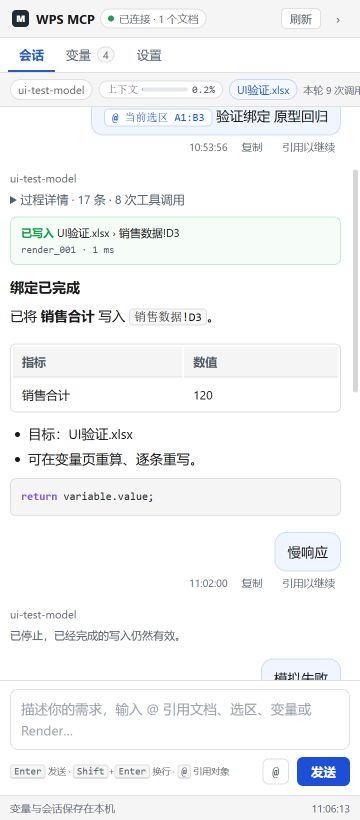
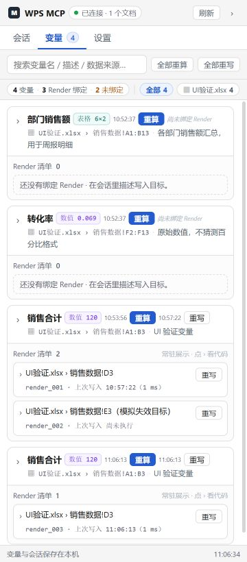
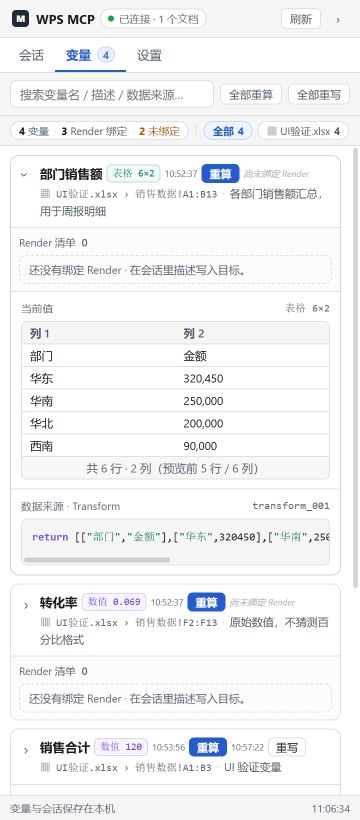
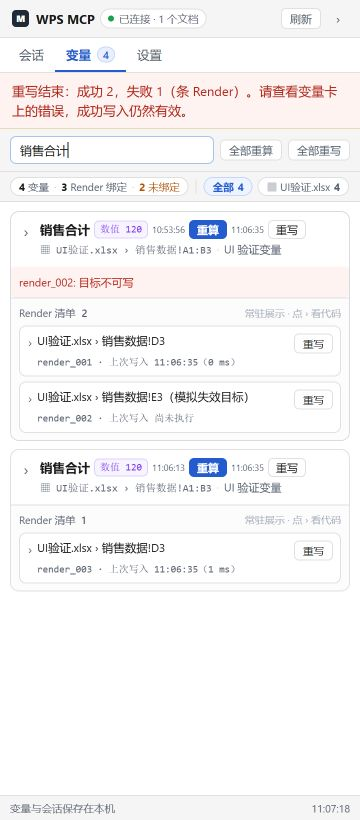
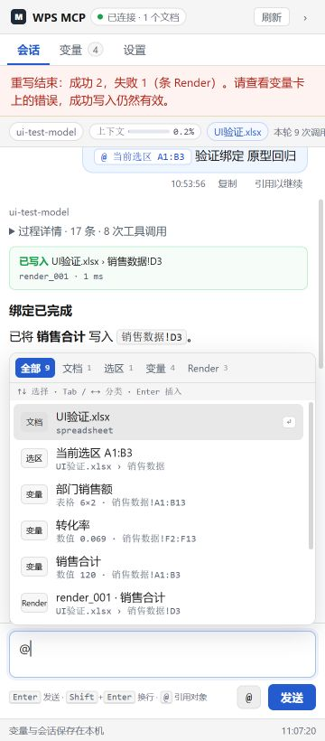
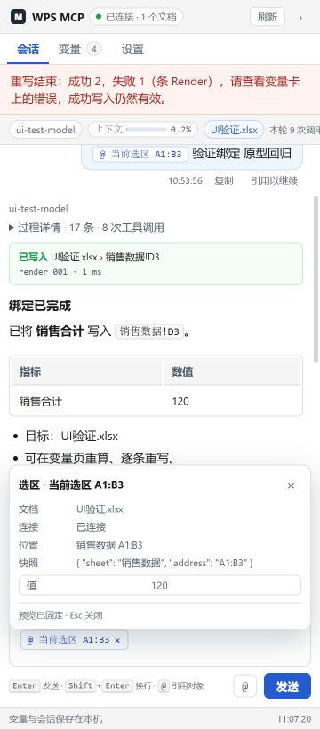
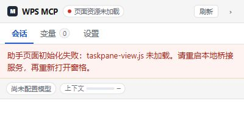

# UI 修复与原型复查（2026-09-30）

本报告保存 2026-09-30 的修复复查记录。A1–A9 的代码修复、自动测试和 400px / 360px 浏览器替身检查已完成；真实 Windows WPS 宿主的显示、收起及 API 行为仍待实机验收。

对照资料：[设计方案](ui-design-plan.md)、[原型](ui-prototype.html)、[修复前检查报告](ui-spec-audit-2026-09-30.md)。截图使用合成数据，不包含用户业务文档。

## 记录版本与验证阶段

| 日期 | 阶段 | 版本标识 | 验证结果 |
|---|---|---|---|
| 2026-09-30 | 初次修复复查 | 历史工作区，原记录未注明提交号 | 构建、26/26 自动测试及窄窗格浏览器检查通过 |
| 2026-09-30 | 页面依赖加载失败回归 | 历史工作区，原记录未注明提交号 | 补加载失败提示和回归测试，27/27 自动测试通过 |
| 2026-09-30 | 归档前重新验证 | `8342ce3`，提交本报告前的代码基线 | `npm run check` 通过；`npm test` 37/37 通过 |

26、27、37 是三个阶段的测试总数；历史截图和浏览器观察保留原来的验证范围。归档复跑没有重新执行浏览器或 Windows WPS 检查，不把自动测试通过视作宿主验收通过。

当时 Windows WPS 任务窗格持续显示“正在连接”，原因是旧桥接进程对 `taskpane-view.js` / `pinyin-pro.js` 返回 404，而 Bridge 和文档连接本身正常。新增加载失败提示及 [重启脚本](../scripts/restart-local-bridge.ps1)帮助恢复；本报告不证明当前本机进程的部署状态。

## 修复结果

| 编号 | 修复 | 复查结果 |
|---|---|---|
| A1 | 工具执行前保存绑定目标快照；常驻展示目标、位置、renderId、真实耗时和逐条成功/失败；最终答复旁保留本轮写入结果 | 通过。创建绑定和执行写入分开标注；失败、停止、结果缺失不会被标为完成 |
| A2 | 转义后渲染标题、列表、加粗、行内代码、代码块、表格和 HTTP(S) 链接 | 通过。流式与历史共用渲染器，模型原始 HTML 和危险链接不会执行 |
| A3 | pi 会话附加回合元数据，保存工具参数、结果、耗时、目标快照、引用和用量；历史按调用 ID 配对 | 通过。页面刷新前后过程数据一致，服务重启后元数据保留 |
| A4 | 增加 assistant 消息边界，独立显示各次思考；保存内容块出现顺序，结束后按回合折叠过程 | 通过。9 次模型调用、8 次工具调用、9 段思考不会合并，最终答复独立显示 |
| A5 | Render 常驻行显示文档、位置、ID、时间、耗时、单条重写；只折叠代码和详情 | 通过。400px / 360px 下单条操作可见 |
| A6 | 分类和计数、文字/拼音全拼/首字母、分类键盘切换、行内 chip、移除、悬停/固定预览、仅引用发送 | 通过。实测“把变量引用写到 Render 引用”的相对位置在发送后保留；选区按快照中的工作表和地址预览 |
| A7 | 变量/Render/未绑定统计、按文件计数和筛选、数值摘要、表格预览、紧凑卡片和代码着色 | 通过。长代码及宽表格在各自区域滚动，页面和变量卡无横向溢出 |
| A8 | 可见页面定期同步，焦点、页签进入和手动刷新同步历史/配置；保留未保存草稿，保存时检查配置版本 | 通过。另一个面板运行时禁用发送；远端配置更新后显示冲突，拒绝旧表单覆盖 |
| A9 | 官方模式的协议/兼容字段禁用并说明；保存时规范化，目录价格只作为读取信息 | 通过。自定义模式仍可编辑，官方无效覆盖不再持久化 |

其他已补齐：消息时间、复制/引用以继续、逐轮模型名、真实上下文估算、整轮 tokens、配置生效摘要、推理能力提示、按 Render 条数计算批量成功/失败、收起按钮。停止或失败后保留待重发草稿。

## 验证证据

- 初次复查的 `npm test`：TypeScript 构建成功，26/26 通过，包含原有守卫、MCP/API、取消和配置隐私测试；后续复跑见上方阶段表。
- 新增 `test/ui-view.test.mjs`：安全 Markdown、拼音、流式/历史顺序、工具参数和耗时、历史目标、防止错误完成文案、预览边界、宿主 pane ID、旧引用兼容和其他面板执行中状态。
- 新增 `test/ui-recovery.test.mjs`：会话元数据及重启恢复、配置版本冲突、官方字段规范化、仅保留八个工具、只读选区预览及限制、多个 Render 的部分失败。
- 浏览器实测：引用首字母筛选、chip 插入/预览、仅引用发送、两引用的正文关联、Markdown、刷新恢复、值/代码展开、批量部分失败、两个页面的运行互斥/配置冲突、停止和模型失败后的消息恢复。浏览器控制台未见脚本错误。
- 真实流式和刷新后读取的过程块、工具参数、耗时、结果及写入事实一致。模拟 9 次模型调用共 450 tokens，顶部显示整轮合计，而上下文取 SDK 估算。
- 所有测试使用临时数据目录、确定性本地模型和 WPS 文档替身，没有改用户文档或请求真实付费模型。

截图是正式页面在上述测试数据下的结果；原型含模拟外壳和不同示例数据，本次不宣称同数据的像素一致。

## 与原型保留的差异

1. **真实数据替代演示数据**：无假 WPS 外壳、重播按钮、固定 12%、随机耗时或虚构余额。内置价格标为 SDK 目录参考价，不是实时账单。
2. **宿主保留两个缓存窗格**：沿用现有助手/变量入口的缓存方式，补齐同步和草稿保护；未增加多会话。隐藏窗格在再次显示/进入页签时同步，另一窗格的过程按消息边界及轮询同步。
3. **预览有明确边界**：表格最多预览 5 行 / 6 列；二维数组没有表头元数据时使用列编号。选区读取通过同一受守卫的 `wps.exec`，明确匹配文档名和工作表，单次最多读取 5×6。非表格或地址不明确的选区只显示元数据，不能臆造值。
4. **不猜测数值含义**：`0.069` 保持实际数值；现有变量模型没有百分比/单位格式字段，不能仅凭名称把它变成 `6.9%`。
5. **旧历史无法补造事实**：旧会话可恢复已有思考、参数、结果及引用；从未记录的工具总耗时标为“历史耗时未记录”。没有正文位置标记的旧引用仍放在消息旁，引用以继续时保留对象。新消息保存准确位置。
6. **轻量 Markdown 和原生折叠控件**：实现原型使用的常见正文能力；不引入框架或前端构建链。原型的部分装饰图标采用文字/原生箭头，边框、配色、密度和主要信息层级已对齐。

## 人工验收

**状态：待完成 Windows WPS 实机验收。** 以下为验收步骤，必须使用可丢弃的合成文档；先确保桥接服务与加载项运行同一版本，再记录 WPS 版本、操作系统、代码提交及各项实际结果。
1. 按原来的启动方式重启本地桥接服务，重新加载 WPS 加载项/任务窗格。只点击页面的“刷新”不会重启服务或重新加载脚本；若 WPS 缓存旧页面，请重新打开 WPS。
2. 在表格中选择区域，输入 `@dqxq`，插入并点击选区引用，核对文档、工作表、地址及预览；尝试一条仅含引用的消息。
3. 请求创建变量并写到明确位置。核对思考/工具过程、常驻写入事实和实际文档；重新打开窗格，确认参数、结果及耗时仍可查看。
4. 在变量页检查统计、值预览、常驻 Render 及单条重写；改变源值后重算，再重写，核对实际目标。
5. 从两个 ribbon 入口打开面板，检查会话/配置同步及草稿冲突保护；测试推理模型、停止和错误场景。
6. 验证宿主收起按钮及重新显示。收起使用缓存 pane ID；浏览器替身测试覆盖 ID=0，但 Windows WPS 的宿主接口仍以实际环境为准。

可选的独立浏览器复现：构建后运行 `node test/helpers/ui-preview.mjs`，打开其输出的 base 地址加 `/addon/taskpane.html`；发送“验证绑定 原型回归”。终端输入 `partial` 增加故障 Render，输入 `close` 关闭并清理临时数据。此入口仅用于测试，不应替代正式 WPS 验收。
